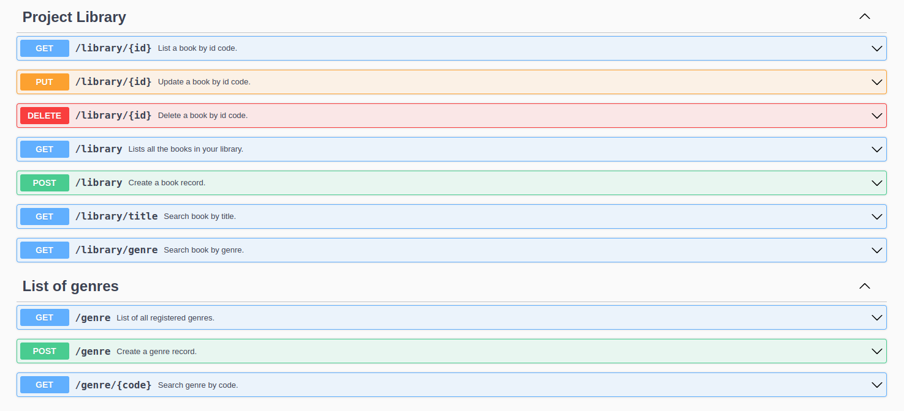

# Projeto Library 📚


### 📑 Índice
---

- [Problemática](#-problemática)
- [Objetivos Gerais](#objetivos-gerais)
- [Tecnologias](#-tecnologias)
- [Objetivos na implementação](#-objetivos-na-implementação)
- [Arquitetura de diretório](#-arquitetura)
- [Orientações](#-orientações)
   - [Pré-requisitos](#-pré-requisitos)
   - [Rodando o Back End (servidor)](#-rodando-o-back-end-servidor)
   - [Rotas, links e métodos](#-rotas-links-e-métodos)
- [Tratamento de erro](#-orientações)
- [Planejamento para próximas etapas](#planejamento-para-próximas-etapas)
- [Referencial Teórico](#referencial-teórico)


### ❓ Problemática
Para o gerenciamento e catatolagação de livros de sua biblioteca pessoal foi realizado projeto de uma API RESTful para por em prática estudo voltado para desenvolvimento backend, usando ecossistema Spring Framework.

### 💾 Objetivo Gerais
Desenvolver uma API segundo o Modelo de Maturidade do Leonard Richardson que segue 4 níveis afim de conseguir construir uma API RESTful:
- [x] Nível 0: Utilizar o protocolo HTTP como mecanismo de comunicação;
- [x] Nível 1: Definir bem, de forma única cada recurso e com substantivos cadas recurso;
- [x] Nível 2: Definir bem o protocolo HTTP e o tipos de retornos possiveis da requisição;
- [x] Nivel 3: Possuir HATEOAS que são hipermídias que mostram seu estado atual e seu relacionamento.


### 💻 Tecnologias
---
As seguintes ferramentas foram usadas na construção do projeto:

- Java;
- Sring Boot;
- Spring Data JPA;
- Swagger Open API;
- MySQL.

### 📌 Objetivos na implementação
---
- [x] Nenhuma query nativa;
- [x] Documentação via Swagger;
- [x] Cobertura de testes acima de 80%;
- [x] Retornos usando de paginação;
- [x] Usar Exception Pattern;
- [x] Usar Stream API.
      
### 🧱 Arquitetura do diretório
---
```
📂 assets
│   └── recurso.png
├── docker-compose.yml
├── mvnw
├── mvnw.cmd
├── pom.xml
├── README.md
├── 📂 src
   ├── main
   │   ├── java
   │   │   └── com
   │   │       └── victoria
   │   │           └── 📂library
   │   │               ├── BookApplication.java
   │   │               ├── 📂config
   │   │               │   └── SwaggerConfig.java
   │   │               ├── 📂controller
   │   │               │   └── BookController.java
   │   │               ├── 📂entity
   │   │               │   ├── Book.java
   │   │               │   └── GenreEnum.java
   │   │               ├── 📂repository
   │   │               │   └── BookRepository.java
   │   │               └── 📂service
   │   │                   ├── BookService.java
   │   │                   └── exception
   │   │                       └── ObjectNotFoudException.java
   │   └── 📂resources
   │       └── application.properties
   └── 📂test
       └── java
           └── com
               └── victoria
                   └── library
                       ├── LibraryApplicationTests.java
                       └── 📂service
                           └── BookServiceTest.java


```
### 📌 Orientações
---
### 📎 Pré-requisitos:

Antes de começar, você vai precisar ter instalado em sua máquina apenas as seguintes ferramentas:
* [Git](https://git-scm.com);
* [Docker](https://www.docker.com/);
* Além disto é bom ter um editor para trabalhar com o código como [Intellij](https://www.jetbrains.com/idea/).

#### 🎲 Rodando o Back End 

```bash
# Clone este repositório
$ git clone <https://github.com/victoriardspaiva/library>

# Acesse a pasta do projeto no terminal/cmd
$ cd library

# Instale as dependências
$ sudo docker-compose -f docker-compose.yml up -d

# Levante o servidor, e o Tomcat inciará na porta:8080 - acesse <http://localhost:8080> 
```
### 🚀  Rotas, links e métodos
---
A ferramenta de suporte de criação das requisição usada foi o [Postman](https://www.postman.com/), você pode usar a de sua preferência.
É também possivel ter acesso a collection usada [aqui](assets/Library.postman_collection.json). 

#### 🌐 Variáveis de ambientes: 
---
É possivel criar variáveis que sejam visiveis para todo o escopo do projeto, existem alguns beneficios um dele é não deixar o valor exposto, além de poder ser reutilizado sempre que necessário.

Para criar a variavel é necessário na collection > aba Variables preencha na coluna variable da tabela o nome da variavel `URL` e em initial value e current value colocar o valor `http://localhost:9090`

> Na barra de URL `endpoint`, vamos preencher o nome da variavel entre dois cochetes `{{URL}}`.

### 🏁  Recursos:
---
É possivel conferir a documentação no link:
[Swagger](http://localhost:8080/swagger-ui/index.html)



### 🚧 Tratamento de erro
---
- [x] Pesquisa por livro não encontrada;
- [x] Livro já cadastrado;
- [x] Gênero não encontrado;
- [x] Gênero já cadastrado. 

### 🚀 Planejamento para próximas etapas
---
- [ ] Ampliar os tipos de tratamento de erros com Exceptions;
- [ ] Maturidade no Stream API;
- [ ] Buscar complexidade em relacionamento de tabelas;
- [ ] Incluir camada de autenticação Spring Boot Security;
- [ ] Implementar microservice de mensageria com Spring Mail, para aviso de emprestimo e devolução de livros;
- [ ] Incluir Specification Pattern.

  
### 📃 Referencial Teórico
---
- Fundamentos do Desenho Orientado a Objeto com UML. Meilir Page-Jones
- Spring Boot, da API REST aos Microservices. Michelli Brito.


